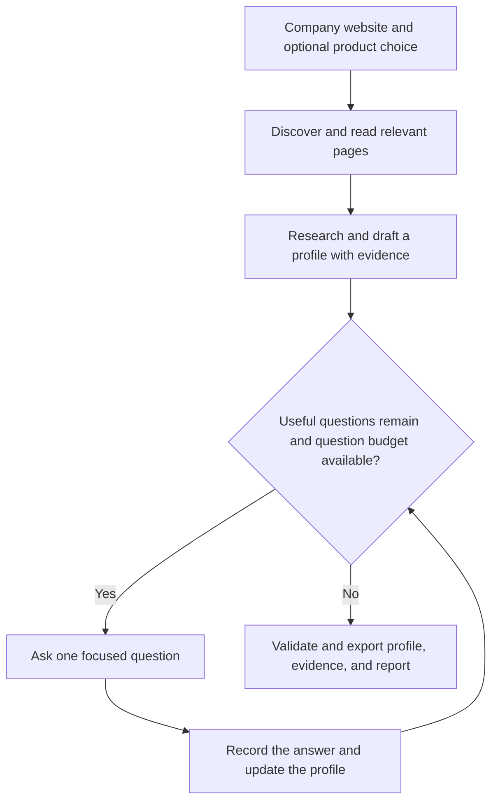

# Company Profile Builder

Turn a company website and a short interview into a structured company profile.

The tool researches what the company sells, who it serves, and how it talks about its
products. It then asks you about important details the website leaves unclear and saves
the profile alongside its sources and your answers.

Each run focuses on **one product**. By default, it scrapes up to **10 unique pages** and
asks up to **5 questions**, including follow-ups. It can finish earlier when no useful
questions remain.

Built with Python, Deep Agents, LangGraph, OpenAI, and Firecrawl.

## Quick start

You need **Python 3.12+**, **uv**, and API keys for **OpenAI** and **Firecrawl** for a live run.
After cloning this repository, run the following from its root directory:

```bash
uv sync --frozen
cp .env.example .env
```

Open `.env` and replace the placeholder credentials:

```dotenv
OPENAI_API_KEY=your-openai-api-key
FIRECRAWL_API_KEY=your-firecrawl-api-key
```

Check your configuration and provider connectivity:

```bash
uv run python -m profile_builder doctor
```

Start a profile for your company (replace the example URL and product name):

```bash
uv run python -m profile_builder start \
  --url https://www.example.com/ \
  --product "Your Product"
```

The terminal shows progress, prints a run ID, and waits for your answers when needed.
If you omit `--product` and the website offers several products, the agent is instructed
to ask which one to focus on before drafting.

## How a run works



The agent chooses pages that explain the product, customers, and company. It searches
saved passages for relevant information, then interviews you about gaps, conflicting
claims, or preferences that the website cannot settle.

Your corrections take precedence over website claims. The original evidence is retained
for review. Unresolved conflicts and values without accepted evidence are omitted from
the final profile.

## Answering questions and resuming

An interview question might look like this:

> **Question:** Who usually makes the buying decision for this product?
>
> **Why this is unclear:** The website describes customer industries but does not name buyer roles.
>
> **Your answer:** The CISO and Head of Data Security.

Answer in your own words, or use one of these commands:

| Input | What happens |
|---|---|
| `skip` | Leave this question unresolved and move on. |
| `idk` or `I don't know` | Record that you do not know the answer and move on. |
| `exit` | Save progress and leave the interview. |

To check or continue a run, replace the placeholder below with the run ID printed in
your terminal:

```bash
RUN_ID="paste-your-run-id-here"
uv run python -m profile_builder status --run-id "$RUN_ID"
uv run python -m profile_builder resume --run-id "$RUN_ID"
```

Resuming uses the saved answers and cached pages. Keep the `.runs/` directory between
sessions. If you chose a custom `--runs-dir`, pass that same directory when resuming or
inspecting the run.

## Understanding the output

Files are saved under `.runs/<run_id>/`:

| File | What to use it for |
|---|---|
| `company_brain.json` | The structured profile: company, product, customers, supporting content, and brand. |
| `evidence.json` | Trace fields to page excerpts or interview answers; inspect warnings, conflicts, and usage. |
| `report.md` | Read a human-friendly summary of coverage, questions, remaining gaps, and warnings. |
| `events.jsonl` and `run.log` | Investigate what happened during the run. |

Unknown strings are `""` and unknown collections are `[]`. Run metadata stays outside
the profile so it follows the fixed [JSON Schema](schema/company_brain.schema.json).

A **complete** run has finished its workflow; some fields may still be unknown. A
**partial** result means the run was cut short or relied on the interview without usable
website pages. Check the report for the reason and any remaining gaps.

Evidence checks make claims traceable. They do not guarantee that a source is correct
or that every interpretation is accurate; review the profile alongside its evidence.

Inspect a particular field from the terminal:

```bash
uv run python -m profile_builder inspect \
  --run-id "$RUN_ID" --field customer.target_customer
```

For a saved example, open the [profile](examples/fortanix/company_brain.json),
[evidence](examples/fortanix/evidence.json), [report](examples/fortanix/report.md), or
[terminal transcript](examples/fortanix/transcript.txt). The example's interview answers
were supplied by the candidate as a proxy, rather than confirmed by the company.

## Useful commands and settings

Prefix each command below with `uv run python -m profile_builder`.
`ID` stands for your saved run ID.

| Command | Purpose |
|---|---|
| `start --url URL` | Start a new profile. |
| `resume --run-id ID` | Continue a paused or interrupted run. |
| `status --run-id ID` | Check progress, questions, warnings, and estimated cost. |
| `inspect --run-id ID` | View populated fields and their supporting evidence. |
| `export --run-id ID` | Rebuild output files from the latest saved draft without calling the agent. |
| `logs --run-id ID --tail 20` | Read recent events. |
| `list` | List saved runs. |
| `schema` | Print the output's JSON Schema. |
| `doctor` | Check configuration, provider connectivity, and the output directory. |

Use `--help` after any command for its full options. Global `-v` (verbose) and `-q`
(quiet) flags go before the command.

These are the main options for `start`:

| Option | Default | Purpose |
|---|---|---|
| `--product "Name"` | Ask if needed | Focus the run on one product. |
| `--max-pages N` | 10 | Limit unique pages scraped. |
| `--max-questions N` | 5 | Limit interview questions, including follow-ups. |
| `--tier fast` or `--tier quality` | `fast` | Choose the configured model: `gpt-5-mini` or `gpt-5.4`. |
| `--budget-usd X` | No cap | Stop before another model call once estimated spend reaches the cap. |
| `--no-embeddings` | Embeddings enabled | Use keyword search alone. |
| `--non-interactive` | Interactive | Automatically skip interview questions. |
| `--runs-dir DIR` | `.runs` | Choose where to store progress and outputs. |

`--model` overrides the tier with an explicit model ID. Budget estimates cover model and
embedding usage; Firecrawl usage is separate. Checks occur between model calls, so a
single call can take estimated spend above the cap.

CLI flags override environment variables, then `.env`, then defaults.
See [.env.example](.env.example) for all settings, including timeouts and optional tracing.

## Design and reliability

**Deep Agents and OpenAI** make research decisions: which pages to read, what information
is missing, and which questions are useful. **Firecrawl** retrieves website content.
The retrieval layer combines keyword and embedding search to return relevant passages
without putting entire pages into every prompt.

**Pydantic** validates the output structure. Evidence checks link individual values to
cached page excerpts or recorded answers. **LangGraph and SQLite** save workflow progress,
drafts, questions, and answers so a run can continue after interruption.

Middleware handles retries, execution limits, and usage logging. URL guards and
untrusted-content handling constrain what the agent can fetch and do.

See [Architecture](ARCHITECTURE.md) for design decisions, persistence, and tradeoffs,
and [Security](SECURITY.md) for safeguards and their limits.

## Development and troubleshooting

Install the development tools and run the checks:

```bash
uv sync --frozen --extra dev
make test
make lint
```

The tests use a scripted model and saved website fixtures, so they run offline without
API keys. They cover the profile contract, evidence handling, corrections, limits,
provider failures, and interruption/resume behavior.

To try the CLI with your own saved pages:

```bash
uv run python -m profile_builder start \
  --url https://www.example.com/ \
  --product "Your Product" \
  --fixtures path/to/your/fixtures
```

This replaces Firecrawl page fetching with local files. It still needs an OpenAI key and
network access for model calls and URL/robots checks.

| Situation | What to do |
|---|---|
| Missing key or provider rejection | Check `.env`, run `doctor`, and confirm your account can use the selected model. |
| Paused or interrupted run | Check `status` and `logs`, then use `resume`. |
| Partial result after a budget or model-call limit | Follow the printed resume hint, raising `--budget-usd` or `--max-questions` as appropriate. |
| No usable website pages | Check the URL and page errors in the logs. A saved draft may still be exported as an interview-only partial result. |
| Empty fields or omitted claims | Read the report and evidence warnings to see what could not be supported or resolved. |
| Failed run with an earlier valid draft | Use `export --run-id ID` to recover that draft's supported contents. |

A partial run normally needs an explicit budget or question-limit override to continue.
An unfinished interview can still be resumed. Exporting an unfinished run labels its
outputs partial and keeps the run resumable.

For scripts, exit codes are `0` for complete, partial, or paused runs; `1` for a failed
run; `2` for usage/configuration errors; and `3` for an interrupted run.
`doctor` returns `1` when a check fails.

<details>
<summary>Optional: run with Docker</summary>

On macOS or Linux, from the repository root with your configured `.env`:

```bash
docker build -t profile-builder .
mkdir -p .runs
docker run --rm -it --user "$(id -u):$(id -g)" \
  --env-file .env -e PROFILE_BUILDER_RUNS_DIR=/runs \
  -v "$PWD/.runs:/runs" \
  profile-builder start --url https://www.example.com/ \
  --product "Your Product"
```

The mounted directory keeps progress after the container exits. Use the same mount and
replace `start ...` with `resume --run-id ID` to continue a run.
Keep `-it` enabled for the interview.

</details>

License: MIT.
